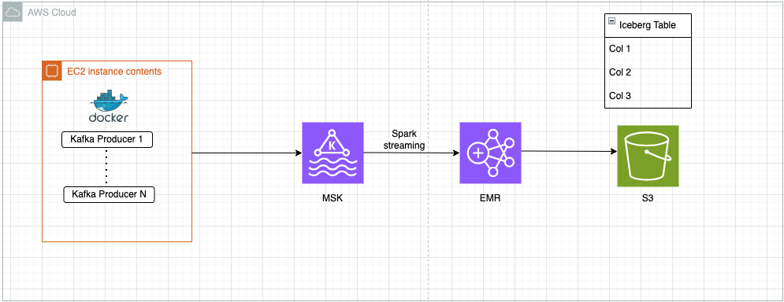
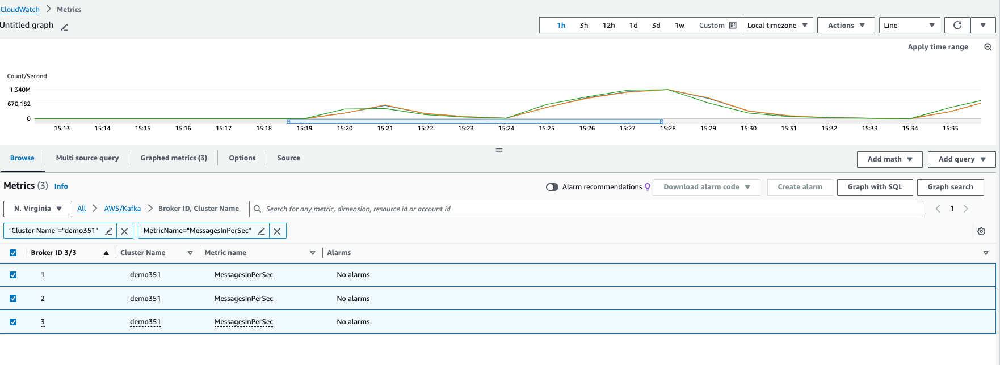
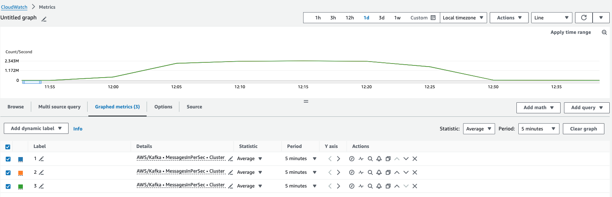
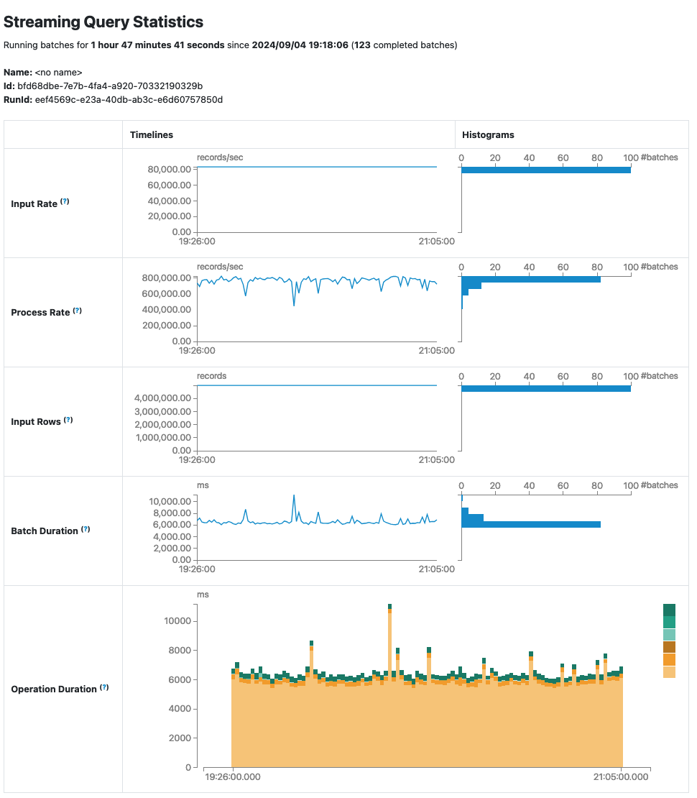
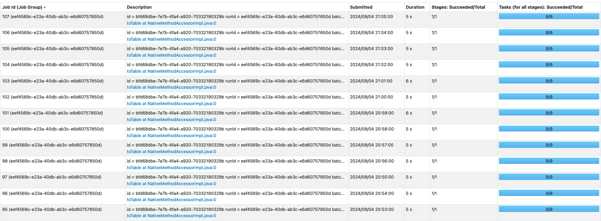

# EMR MSK Run Book

The purpose of this run book is to quickly get started with streaming workflow using MSK,spark streaming on EMR and writing output to Iceberg tables on S3. It also includes a set of standard best practices that allow customers to design their workflows and optimize them. Below is a quick summary of what this run book covers

- MSK cluster set up with IAM Authentication
- MSK client set up
- Example MSK producer python script 
- EMR cluster set up (Can use EMR Serverless as well)
- Example Spark Consumer python script
- Scaling your workflow
- General Best Practices

Lets get started !!!



1. MSK cluster set up

    Follow the [documentation](https://docs.aws.amazon.com/msk/latest/developerguide/msk-create-cluster.html) to create MSK Cluster. High level steps are given below

    1. Log in to AWS console and navigate to Amazon MSK console
    2. Click create cluster.  Select Provisioned or Serverless. Refer this [blog](https://aws.amazon.com/blogs/big-data/how-to-choose-the-right-amazon-msk-cluster-type-for-you/)
    3. Choose an appropriate Kafka version. Note - With Apache Kafka 3.7x+, you can choose Metadata mode as Kraft mode, that allows you to add up to 60 brokers to host more partitions per-cluster, without requesting a limit increase, compared to the 30-broker quota on Zookeeper-based clusters.
    4. For Broker types - refer to this [guide](https://docs.aws.amazon.com/msk/latest/developerguide/msk-provision-throughput.html) . You should select broker size depending upon total throughput expectations from the cluster.
    5. Select a min of 1 brokers per zone. Total 3 brokers distributed evenly across your 3 Availability Zones
    6. Select your vpc, availability zone, subnets and security group. 
    7. Chose IAM for authentication

2. Create IAM role - Follow [this](https://docs.aws.amazon.com/msk/latest/developerguide/create-client-iam-role.html)

3. MSK Client - Follow [this](https://docs.aws.amazon.com/msk/latest/developerguide/create-client-machine.html) to create client machine on EC2 instance. SInce we will be running large scale tests, pick a larger instance type with 100+ vcpu. Make sure EC2 instance is attached with IAM role created in last step. Also ensure security groups and rules are added as described in the doc. 

4. Create Kafka topic - Follow [this](https://docs.aws.amazon.com/msk/latest/developerguide/create-topic.html). Alternatively, follow below steps
```
#install java 
sudo yum -y install java-11

#download kafka libraries. Change the version if you need a different one
wget https://archive.apache.org/dist/kafka/3.5.1/kafka_2.13-3.5.1.tgz
tar -xzf kafka_2.13-3.5.1.tgz

cd kafka_2.13-{YOUR MSK VERSION}/libs
wget https://github.com/aws/aws-msk-iam-auth/releases/download/v1.1.1/aws-msk-iam-auth-1.1.1-all.jar

#create kafka_2.13-3.5.1/bin/client.properties and add below for IAM authentication
security.protocol=SASL_SSL
sasl.mechanism=AWS_MSK_IAM
sasl.jaas.config=software.amazon.msk.auth.iam.IAMLoginModule required;
sasl.client.callback.handler.class=software.amazon.msk.auth.iam.IAMClientCallbackHandler

#create topic
export BS=<kafka_private_endpoint from Kafka console>
sh kafka_2.13-3.5.1/bin/kafka-topics.sh --bootstrap-server $BS --create --topic demo --partitions 3--replication-factor 3

```

5. Generate data
Download all the files provided in the project on your kafka client machine. Change the variables in kafka-auth.py. It will be used to push data to Kafka topic. We will use Docker to run multiple instances of kafka producer for data generation at scale. Below are steps to install and run docker

```
#Docker install
sudo yum install docker -y
sudo systemctl start docker
sudo systemctl enable docker
docker --version

#test docker execution
sudo docker build -t demo .
export BS=<kafka_private_endpoint from Kafka console>
sudo docker run -it demo --topic-name demo315 --cycle 10 -c 200 --client-id Kafka-P01 --broker $BS

```
kafka-auth.py has 2 arguments. --cycle means how many times data generation loop will run in the script and -c (count) is the number of messages generated per loop.
Once you have tested. Now lets run multiple producers as docker containers. For this we will use run-docker.sh script. You can alter --cycle and -c arguments in the script as well. 

```
#Run multiple kafka producers as docker container
sh run-docker.sh 100 demo $BS
```
Above will run 100 kafka producers. 

6. Create EMR Cluster. Follow [this](https://docs.aws.amazon.com/emr/latest/ManagementGuide/emr-gs.html#emr-getting-started-launch-sample-cluster)
Make sure security group for both primary node and core/task node have inbound rules for MSK scurity group. If you are using default EMR roles, attach the MSK IAM policy created in step 2 to EMR_EC2_DefaultRole to allow EMR cluster read from Kafka topic. Size the cluster such that you have atleast the same number of total vCPU as number of partitions of kafka topic. Enable managed scaling as well to dynamically add resources.

7. Enable Spark Consumer 
Copy emr-msk-consumer.py to the EMR cluster primary node. Change the configurations in the script, mostly below ones 

```
CATALOG = "glue"
DATABASE = "<DB_name>"
TABLE = "<Table_name>"
WAREHOUSE = "s3://<bucket_name>/warehouse/"
bootstrap_server = "Kafka_client_bootstrap_server_from_MSK_console"
topic = "demo"
checkpoint_location = "s3://<bucket_name>/checkpoint/"

```

Now lets run the spark-submit to start consuming messages and writing to Iceberg table on S3

```
spark-submit --packages org.apache.spark:spark-sql-kafka-0-10_2.12:3.5.0,org.apache.spark:spark-avro_2.12:3.5.0 --jars /home/hadoop/kafka/kafka_2.12-2.8.1/libs/aws-msk-iam-auth-1.1.1-all.jar,/usr/share/aws/iceberg/lib/iceberg-spark3-runtime.jar emr-msk-consumer.py 
```

8. Scaling
With MSK 3 kafka.m7g.large instances producer script was able to generate ~3.9mn messages per sec. 


With 3 * kafkam7g.4xl with provisioned throughput enabled and topic with 9 partitions(3 in each broker), we were able to generate ~7mn messages per sec


On the Spark consumer side, we were able to process 800,000 records per sec. This can be further increased by adding more partitions in your kafka topic. You will notice all stages have 9 tasks. This is because we only have 9 partitions in kafka topic. So, even if you have more executors, they will sit idle. 





9. General Recommendations:
- MSK
    * Confluent’s Python Kafka package wraps the librdkafka C/C++ library and is much more efficient for high load than kafka python which is just a pure python implementation. Check this [github](https://github.com/aws/aws-msk-iam-sasl-signer-python) to set up IAM auth for python clients.
    * Payload size can become a major contributor in throughput bottleneck
    * Default MSK cluster only provide 250MiB/s of storage throughput (including ingress and egrees). Use provisioned throughput if you are hitting this limit
    * Serialize your payload with avro and compress using snappy
- Apache Iceberg 
    * When choosing to write data as Iceberg, use fanout writer for streaming workloads to avoid latency induced by repartitioning and sorting. Avoid using it for batch. 
        ```
        data.writeStream.
        format("iceberg").
        outputMode("append").
        trigger(Trigger.ProcessingTime(1, TimeUnit.MINUTES)).
        option("fanout-enabled", "true").
        option("checkpointLocation", checkpointPath).
        toTable("database.table_name")
        ```
    * It is recommended to have a trigger interval of 1 minute at the minimum and increase the interval if needed in order to avoid too many small files
    * For streaming jobs, snapshots accumulate quickly with frequent commits. Regularly perform snapshot [expiration](https://iceberg.apache.org/docs/1.4.0/spark-procedures/#expire_snapshots). Default is 5 days. 
    * Compact data files frequently. Similarly perform frequent manifest file rewrite. 
    * You can set write.distribution-mode to none if write latency needs to be minimized. This will avoid additional shuffling. 
    * Similarly, you can use Iceberg merge-on-read to optimize for writes. However, this will impact read performance and regular compaction will be required to prevent further degradation over time. 
    * Iceberg allows several write formats. Default is parquet. You can choose Avro to get even faster writes at the trade off for slower reads. 

- Apache Spark on EMR
    * MSK partitions and Spark tasks maintain 1:1 mapping. In order to scale spark, ensure kafka partitions are increased as well. 
    * EMR comes with Spark dynamic allocation enabled. It can lead to too frequent churn of executors. You can increase spark.dynamicAllocation.executorIdleTimeout . Default 60s might be too small for streaming jobs. 
    * Since most of the tasks in streaming job are small, dynamic allocation can tend to over allocate executors to get maximum parallelism. You can adjust spark.dynamicAllocation.executorAllocationRatio  to 0.7 or 0.5 to adjust executor allocation. 
    * Adjust maxOffsetsPerTrigger to rate limit maximum number of offsets processed per trigger interval. 


